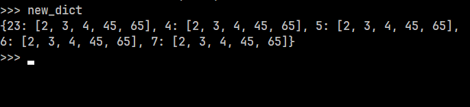

## Dictionary
#### Basic of dictionary is key, value pair.


1) A dictionary consists of a collection of key-value pairs. Each key-value pair maps the key to its associated value.

2) Basic syntex of dictionary is:
```python
    dict1= {'key': 'value'} 
    #firt element always be an key and second one will always be an value.
    print(dict1)

```

3) We can reterive our elements by using our indexing method as we did in `list`.

```python
    print(dict1['Sonam'])   #90
```
And other way is by using predefined `get()` for dictionary.

```python
    print(dict1.get('Sonam'))   #90
```

* Here the main difference between reteriving the elements by `indexing` and `get()` is:
<br>`Indexing` not handles the error while,    `get()` handles the error when we use wrong key in that case.  

4) So, dictionary is `mutable` it means we can chnage the value of dictionary.

```python
    dict1['Aman']= 80   #chnage the value of Aman into 80

    print(dict1['Aman'])
```

5) We can use iteration for our dictionary elements:
```python
    for i in dict1:

        print(i, dict1[i])
```
### Or

```python
    #Imp syntex for dictionary related problems
    for key, values in dict1.items():
        
        print(key, values)
```
Here in above syntex we iterate our items of dict1 with key and value pair.

6) Dictionary also contain some built-in functions. Some of them are down below:

```python
    #Dictionary built in methods.

    len(dict1)  #For finding the lenght

    dict1['Komal']= 33 #Add an elemnt into the dictionary
    print(dict1) 

    dict1.pop('Aman')  #For poping it out
    print(dict1) 

    dict1.popitem()    #Autometically remove last one
    print(dict1)

    dict2 =dict1.copy() #copy the elements of the dictionary
    print(dict2)

    dict2.update({'uday':89, 'ankur': 28 }) #adds the element of dictionary
    print(dict2)

    dict2.clear()   #For deleting the whole dictionary
```

7) We can also solve squred number problem with `dictionary` datatype, as we also did this with `list` datatype.

```python
    #Squred number problem with Dictionary:

    squre_num= {x: x**2 for x in range(20)}
    print(squre_num)
```

8) We can also make an `dictionary` by an list and values.

```python
    ls= ['aman', 'vijay', 'rakesh', 'aditya']

    value= 'pass'

    new_dict= dict.fromkeys(ls, value)
    print(new_dict) 

```
output:
---
